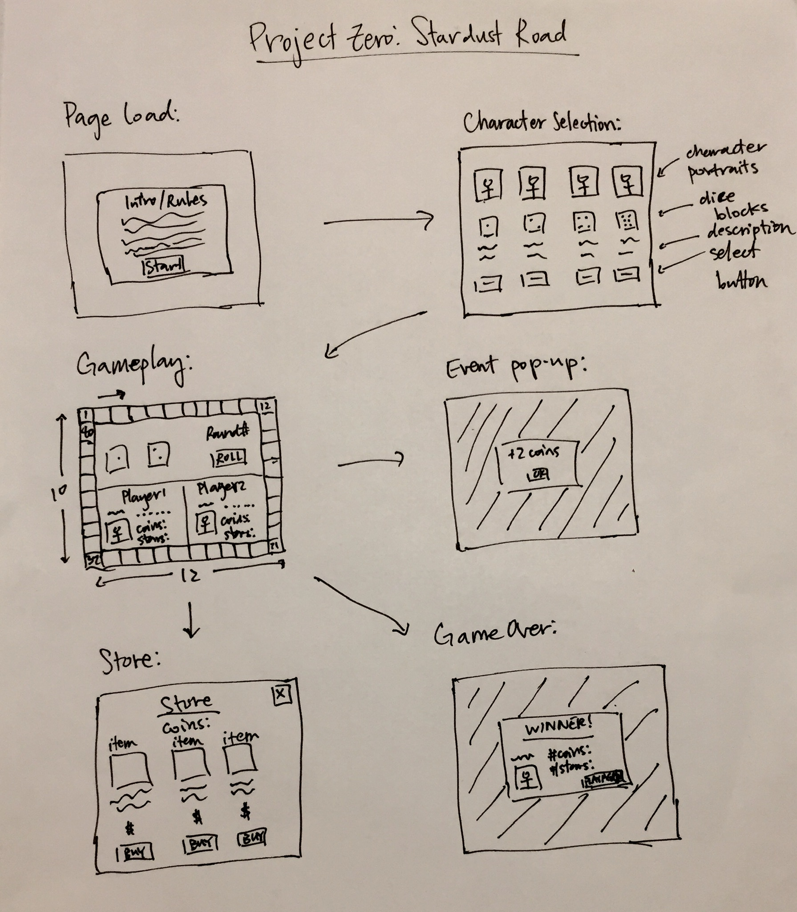

# Project Zero: Stardust Road

// == Stardust Road == //

- The obejctive of this game is to move your piece around the board and collect as many stars as possible within 15 rounds of play

<!-------------------------------------------------------------------------------------------------------->

# User Stories/Game Logic

<!-- Intro -->
- When the page loads, a modal pops up introducing game and explaining the rules (or leave it up as an aside)
- user clicks start button move to character selection page

<!-- Character Selection -->
- Player(s) take turns selecting their character of choice
- Each character has a different dice block
	standard: 1, 2, 3, 4, 5, 6
	dice 2: 0, 2, 4, 4, 4, 6
	dice 3: 1, 3, 3, 3, 5, 6
	dice 4: 3, 3, 3, 3, 4, 4 
- Once characters are selected, display the main gameboard

<!-- Gameboard -->
- The gameboard is made up of 40 different colored spaces surrounding the central UI and scoreboard display
- There will be 30 red, 30 green, 30 yellow, 10 blue spaces arranged in a 
	green-red-yellow-green-red-yellow-green-red-yellow-blue pattern
- A different event alert occurs depending on what color space a player lands on with his/her dice roll
	green: move forward 1/2 spaces
	red: move backward 1/2 space
	yellow: gain 1-5 coins
	blue: access the store
- Accessing the store allows you to spend 3 coins to jump ahead 3-5 spaces, 3 coins to move your opponent back 3-5 spaces or 5 coins to teleport to a random space on the board. If the player does not wish to or does not have enough coins purchase an item they may exit the store. Only 1 option may be chosen per store visit. 

<!-- Scoreboard -->
- The scoreboard should keep track of the round # and what turn it is
- It should also display each players' character (and dice roll outcomes possibilities), and track # of coins and stars

<!-- Gameplay -->
- The game runs for 15 rounds
- A star appears on a random spot on the board at the start of the game
- Once a player reaches a star, a new one appears at another random spot on the board
- Players take turn hitting the roll button, which rolls 2 of their character's dice
- Their game piece moves spaces clockwise on the board according to the combined dice roll
- Once they land on a space, check the color of the space and activate the corresponding event
- This event color check only occurs after the player's intitial dice roll of the turn (once per turn)

<!-- End Game -->
- After the 30th turn, the game ends
- All remaining coins are converted to stars at a 15 coins to 1 star ratio 
- The player with the most stars wins and the winner is announced
- Players may click 'play again' button to reset the game and start at character selection

<!-------------------------------------------------------------------------------------------------------->

# Milestones

1. Build base player and game board objects
2. Build base game logic for die rolls, moving spaces, event checks
3. Render the gameboard and game pieces on the DOM and style appropriately
4. Build all modals and make sure all buttons and event listeners are linked/working correctly
5. Make sure DOM elements are displayed and updating correctly with respect to the game flow
6. Finishing touches, make sure game runs through smoothly and is able to reset

<!-------------------------------------------------------------------------------------------------------->

# Stretch Goals

1. Transform (scale the coins and stars count displayed) whenever they are added 
2. Animate 3D dice rolls
3. Animate the game pieces moving from space to space on the board
4. Sound effects

<!-------------------------------------------------------------------------------------------------------->

# Minimum Viable Product

My goal is to create a game in which 2 players play for 15 rounds, taking turns rolling two die and moving spaces on the game board according to the numbers rolled. The players select from 4 characters which each have their own different dice block with different outcomes. When a player's piece lands on a space after their dice roll, an event is activated depending on the color of the space (green, red, yellow, or blue). The events may either move the player back or forward 1 or 2 spaces, give the player 1 to 5 coins or allow the player to access the store. A star appears at a random spot on the board at the beginning of the game and respawns at another randomn spot on the board when captured (only 1 star is present on the board at any given time). The objective of the game is to capture the most stars by the end of the 15 rounds. Remaining coins are converted into stars at a ratio of 15/1. The player with the most stars is declared the winner. 

<!-------------------------------------------------------------------------------------------------------->

